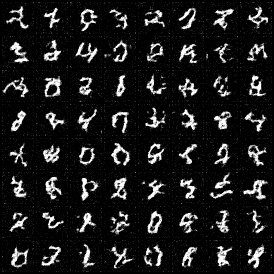
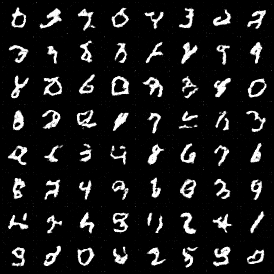
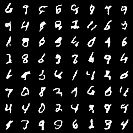
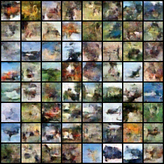
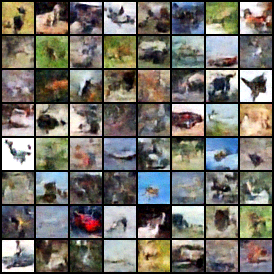
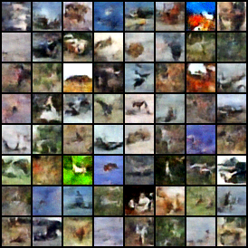

# Consistency models in 200 lines of code

## Introduction
This is an unofficial but simple and single-file pytorch implementation of [consistency models](https://arxiv.org/abs/2303.01469), in **200 lines of code**.

I started from an unofficial implementation from [cloneofsimo](https://github.com/cloneofsimo/consistency_models), but the results seemed not matching the original paper. So I am trying to change things (e.g. the sampling part) following the [official implementation](https://github.com/openai/consistency_models), but the results are still not satisfying.

Free free to contact me if you find any issues or have any suggestions.


## Usage

First, clone this repository. Then, install mainly the following packages:
```bash
Python 3.10
Pytorch 2.2.1
diffusers 0.27.2
```

Finally, run:
```bash
python main.py
```
This contains Consistency Training (CT) and Multistep Consistency Sampling for MNIST and CIFAR-10 datasets.


## Results

* MNIST, 50 epochs, batch_size 256

MNIST (5 steps) |  MNIST (10 steps) | MNIST (20 steps)
:-------------------------:|:-------------------------:|:-------------------------:
  |   | 


* CIFAR-10, 200 epochs, batch_size 256

CIFAR-10 (5 steps) |  CIFAR-10 (10 steps) | CIFAR-10 (20 steps)
:-------------------------:|:-------------------------:|:-------------------------:
  |   | 


# Acknowledgments
* [Consistency models arxiv paper](https://arxiv.org/abs/2303.01469)
* [An unofficial implementation from cloneofsimo](https://github.com/cloneofsimo/consistency_models)
* [The official implementation](https://github.com/openai/consistency_models)
